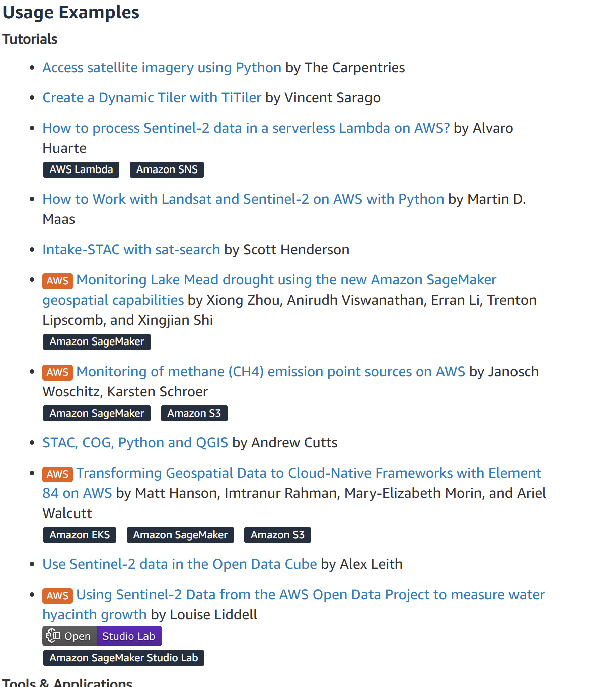
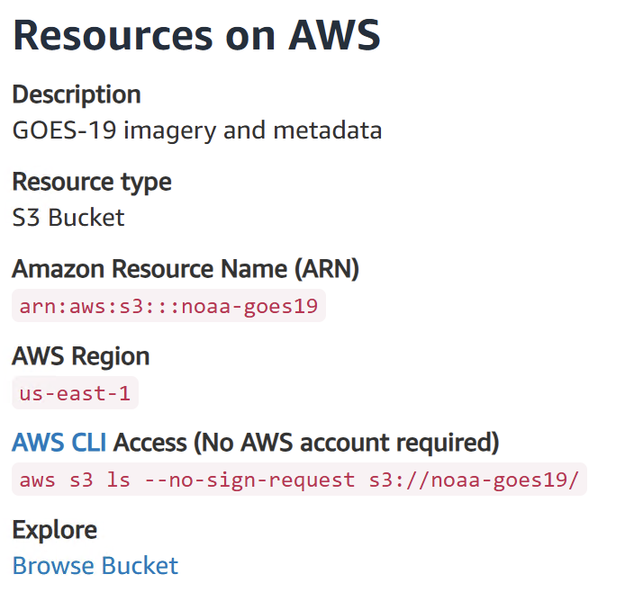

# AWS Open Data Registry

The [Open Data Registry on AWS](https://registy.opendata.aws) is an excellent resource for geospatial data.  It contains a plethora of vector and raster data.  

1. Go to `https://registry.opendata.aws/`
2. In the search data sets use keywords like *satelite*, *africa*, *canopy height model*.

  
  <figcaption><strong>Figure 1:</strong> Search datasets on the AWS Open Data Registry form the landing page.</figcaption>

For example, on the [sentinel-2-lsa-cogs](https://registry.opendata.aws/sentinel-2-l2a-cogs/), below the description take a look at the *Usage Examples*. 

  
  <figcaption><strong>Figure 2:</strong> Search datasets on the AWS Open Data Registry form the landing page.</figcaption>

Also, notice how the *Resources on AWS* have code snippets and links to help you in exploration of data.  

  
  <figcaption><strong>Figure 3:</strong> NOAA GOES-1 Resources on AWS with code snippet and link.</figcaption>

