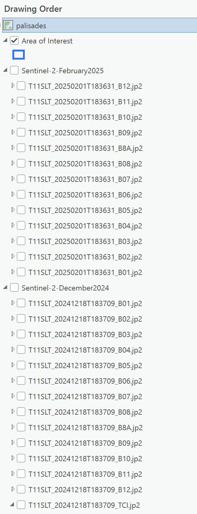

# Palisades Fire

This exercise explores the European Space Agency's [Copernicus Data Space Ecosystem STAC API](https://documentation.dataspace.copernicus.eu/APIs/STAC.html).  Copernicus data is free to abtain, but still requires a login.  Because that takes time to set up, we will query the catalog for data.  I have provided layerfiles for us to use.  

Copernicus Browser  `https://browser.dataspace.copernicus.eu/`

Set up a stac connection in your project. `https://stac.dataspace.copernicus.eu/v1/`  

Zoom in to the Palisades/Malibu area northwest of Los Angeles.  In the project File Geodatabase, I have provided an area of interest. 

    
    <figcaption><strong>Figure 1.</strong>   Rough area of interest for the palisades fire.</figcaption>

For pre-fire, set your temporal extent to 2025-12-10 through 2025-12-31.  When you view your results, click the info button and review the metadata.  Look for cloud cover percentage.  

Repeat the same for post-fire with date range of 2025-02-01 through 2025-02-10.   

    
    <figcaption><strong>Figure 2.</strong>  Sentinel-2 layerfiles.</figcaption>

  

Notice how the downloads have a separate image for each band.  We are going to create several raster functions using the *Raster Calculator* and *Band Conmbination* function.

| Visualization         | Band Combination\* |
| --------------------- | ---------------- |
| Burned Area           | B12, B11, B4     | 
| Fire vs. Vegetation   | B11, B8, B4      |
| Ash and Burn Severity | B12, B8A, B4     |  
| NBR: Normalized Burn Ratio | (B8-B12)/(B8+B12) |

\**Further reading on [Sentinel 2 Bands and Combinations](https://gisgeography.com/sentinel-2-bands-combinations/).*